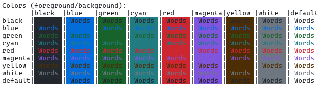
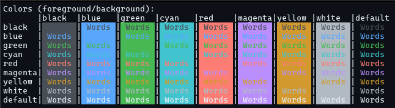

# Rio Terminal GH Theme

[Rio](https://raphamorim.io/rio/) terminal theme inspired on GitHub theme for VS Code and GitHub's [Primer Design System](https://primer.style/)

## Available Themes

### Light (gh-light)



### Dark (gh-dark)



## Installing

Copy the theme TOML files under [./themes](./themes/) to Rio config folder on your system:

| Platform | Path |
| --- | --- |
| Mac | `/Users/YOUR_USERNAME/.config/rio/themes` |
| Linux | `/home/YOUR_USERNAME/.config/rio/themes` |
| Windows | `C:\Users\YOUR_USERNAME\AppData\Local\rio\themes` |

Change Rio configuration file to include your favorite theme:

```toml
#  YOUR_CONFIG_FOLDER_ROOT/rio/config.toml
theme = "gh-light"
```

More details can be found in Rio's configuration docs <https://raphamorim.io/rio/docs/config/theme>.
